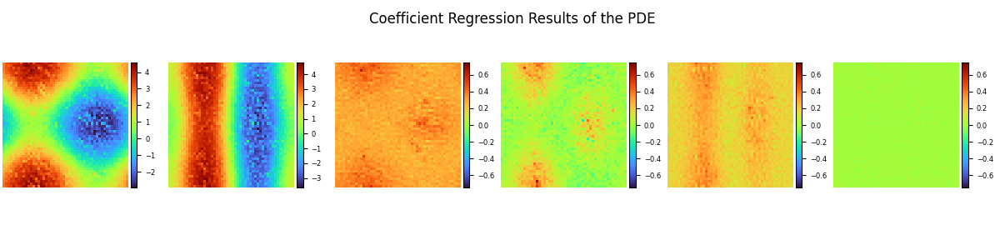

# PDE-Net求解对流扩散方程

## 概述

PDE-Net是Zichao Long等人提出的一种前馈深度网络用于从数据中学习偏微分方程，同时实现了准确预测复杂系统的动力学特性和揭示潜在的PDE模型。PDE-Net的基本思想是通过学习卷积核(滤波器)来逼近微分算子，并应用神经网络或其他机器学习方法来拟合未知的非线性响应。数值实验表明，即使在噪声环境中，该模型也可以识别被观测的动力学方程，并预测相对较长时间的动态行为。更多信息可参考[PDE-Net: Learning PDEs from Data](https://arxiv.org/abs/1710.09668)。


## 模型效果：
### 目标系数：

### 预测系数：


### 长时预测：


### 长期预测任务中的预测误差：


## 环境配置
要求`Mindapore`>=2.0.0,`MindFlow`>=0.1.0
为方便训练文件识别`MindFlow`包，进入主目录运行：
```shell
export ME_PACKAGE_NAME="mindflow"
pip install -e .
```
## 目录介绍
- `mindflow`文件夹存放相关包，直接调用即可
- `pde_net`文件夹为实际的网络训练相关代码

## 模型训练
主目录下pde_net开头的`.ipynb`文件均为核心训练文件，不同后缀代表不同模型参数，其中5和7代表卷积核kernel_size大小，是否有frozen后缀代表滤波器是否进行冻结。
使用[kernel_size=5](pde_net_CN5.ipynb)在Jupyter Notebook逐行运行训练和验证代码，相关代码注释说明已记录在`.ipynb`文件内

## 参数设置
模型参数由`.yaml`文件控制，部分核心参数含义如下：
- enable_noise: 是否引入噪声
- dt：$\delta_t$，用于决定步长
- kernel_size: 控制滤波器大小
- max_order: 预测的PDE方程中导数最高阶是多少
- if_frozen: 是否冻结滤波器
- summary_dir: 训练文件存储目录
- mindrecord_data_dir: 生成数据存储目录


## 工具代码

src 目录下有三个工具类`py`文件代码，因此相关函数说明记录在此Readme中

### `dataset.py`

这个模块提供了用于生成物理模拟数据并将其保存为 MindRecord 格式，以及从 MindRecord 文件中加载和处理数据集的功能，以支持 PDE-Net 等数据驱动的偏微分方程求解模型的训练和测试。

#### 文件结构

-   `dataset.py`: 包含 `DataGenerator` 和 `DataPrepare` 类以及 `create_dataset` 函数，用于数据的生成、保存和加载。
-   `pde_solvers.py`: (假定存在) 包含 `initgen` 和 `VariantCoeLinear2d` 等物理求解器。

### 类和函数说明

#### `class DataGenerator`

`DataGenerator` 类负责根据配置生成物理模拟数据，并将其高效地保存为 MindRecord 文件。它支持训练模式和测试模式的数据生成。

##### 初始化函数：`__init__(self, step, mode, data_size, file_name, config)`

* **参数**:
    * `step` (int): 在测试模式下，表示要生成多少个时间步的数据；在训练模式下，表示 `u0` 到 `uT` 的总时间步长。
    * `mode` (str): 数据生成模式，可以是 `"train"` (生成 `u0` 和 `uT` 数据对) 或 `"test"` (生成 `u0` 和一系列中间时间步 `u_stepX` 的数据)。
    * `data_size` (int): 要生成的数据样本数量。
    * `file_name` (str): 将数据保存到的 MindRecord 文件的完整路径和名称。
    * `config` (dict): 包含各种配置参数的字典，例如：
        * `"solver_mesh_scale"` (int): 求解器网格与输出网格的比例。
        * `"mesh_size"` (int): 最终输出数据的网格大小。
        * `"enable_noise"` (bool): 是否在数据中添加噪声。
        * `"start_noise_level"` (float): 初始时间步的噪声水平。
        * `"end_noise_level"` (float): 后续时间步的噪声水平。
        * `"init_freq"` (float): 初始条件的频率。
        * `"dt"` (float): 物理模拟的时间步长。
        * `"variant_coe_magnitude"` (float): 变系数线性 PDE 的系数幅度。

##### 核心方法：`process(self)`

* **功能**: 根据 `DataGenerator` 实例的初始化参数，生成相应的数据，并将其写入指定的 MindRecord 文件。
* **数据格式**:
    * **训练模式 (`mode="train"`)**: 每个样本包含 `u0` (初始时刻的状态) 和 `uT` (经过 `self.step` 个 `dt` 时间步后的最终状态)。
    * **测试模式 (`mode="test"`)**: 每个样本包含 `u0` (初始时刻的状态) 和从 `u_step1` 到 `u_step{self.step}` 的一系列中间时间步的状态。
* **输出**: 在控制台打印 "Mindrecorder saved" 表示数据保存成功。

##### 内部辅助方法 (无需直接调用):

* `_generate_data_test_mode(self)`: 在测试模式下，使用 `VariantCoeLinear2d` 求解器生成从 `u0` 到 `u_step{self.step}` 的完整时间序列数据。
* `_generate_data_train_mode(self)`: 在训练模式下，生成 `u0` 和经过 `self.step * self.dt` 总时间后的 `uT` 数据。
* `_post_process(self, u)`: 对生成的原始数据进行后处理，包括根据 `solver_mesh_scale` 进行采样，并根据 `enable_noise` 配置添加高斯噪声。

---

#### `class DataPrepare`

`DataPrepare` 类用于从已有的 MindRecord 文件中加载和准备数据集，以便用于 MindSpore 模型的训练和评估。

##### 初始化函数：`__init__(self, config, data_file)`

* **参数**:
    * `config` (dict): 包含配置参数的字典，其中至少包含 `"mesh_size"` 和 `"batch_size"`。
    * `data_file` (str): 要加载的 MindRecord 文件的完整路径和名称。

##### 核心方法：`create_test_dataset(self, step)`

* **功能**: 从 MindRecord 文件中创建一个用于测试的 MindSpore 数据集。
* **参数**:
    * `step` (int): 指定要从 MindRecord 中加载的特定时间步的数据。它将尝试加载 `u0` 和 `u_step{step}` 这两列。
* **返回**: 一个 MindSpore Dataset 对象，每个批次大小为 1。
* **注意**: 此方法依赖于 MindRecord 文件中存在 `u_step{step}` 这样的键。如果数据集中没有对应的键，数据集可能为空或报错。

##### 核心方法：`create_train_dataset(self)`

* **功能**: 从 MindRecord 文件中创建一个用于训练和验证的 MindSpore 数据集。
* **数据列**: 加载 `u0` 和 `uT` 两列数据。
* **批处理**: 将数据集按照 `self.batch_size` 进行批处理。
* **数据变换**: 对 `u0` 和 `uT` 进行 reshape 操作，使其符合模型期望的输入/输出形状 (`N, C, H, W` 或 `N, T, C, H, W`)。
* **数据集分割**: 将训练数据集进一步分割为 50% 的训练集和 50% 的验证集。
* **返回**: 两个 MindSpore Dataset 对象：`dataset_train` 和 `dataset_eval`。

---

#### `function create_dataset`

这是一个顶层函数，用于简化数据生成和加载的流程。

##### 函数签名：`create_dataset(config, step, db_name, mode, data_size=0)`

* **功能**:
    1.  实例化 `DataGenerator` 类，根据提供的参数生成数据并保存为 MindRecord 文件。
    2.  实例化 `DataPrepare` 类，准备从刚生成的 MindRecord 文件中加载数据。
* **参数**:
    * `config` (dict): 包含所有必要配置的字典。
    * `step` (int): 传递给 `DataGenerator` 和 `DataPrepare` 的 `step` 参数，其含义取决于 `mode`。
    * `db_name` (str): 要创建或加载的 MindRecord 文件的名称 (不包含路径)。
    * `mode` (str): 数据生成模式，可以是 `"train"` 或 `"test"`。
    * `data_size` (int): 要生成的数据样本数量 (仅在 `DataGenerator` 中使用)。
* **返回**: 一个 `DataPrepare` 对象，通过它你可以进一步调用 `create_test_dataset` 或 `create_train_dataset` 来获取 MindSpore Dataset 实例。


### `pde_solvers.py`

这个模块提供了基于传统数值方法的偏微分方程 (PDE) 求解器，主要用于生成数据。它包含初始场生成函数和针对特定变系数线性二维 PDE 的求解器。

#### 文件结构

-   `pde_solvers.py`: 包含 `_initgen_periodic`, `initgen`, `_PDESolver` 基类以及 `VariantCoeLinear2d` 求解器。

### 函数说明

#### `function _initgen_periodic`

这是一个内部辅助函数，用于在周期性边界条件下生成初始场。

##### 函数签名：`_initgen_periodic(mesh_size, freq=3)`

* **功能**: 生成具有特定频率特征的二维周期性初始场。
* **参数**:
    * `mesh_size` (tuple/list): 网格的大小，例如 `(64, 64)` 表示 64x64 的网格。
    * `freq` (int): 控制生成初始场的频率特性。
* **返回**: (numpy.ndarray) 生成的初始场，形状与 `mesh_size` 相同。

#### `function initgen`

这是一个初始值生成器，根据指定的边界条件生成初始场。

##### 函数签名：`initgen(mesh_size, freq=3, boundary='Periodic')`

* **功能**: 生成用于 PDE 模拟的初始条件。支持周期性 (`'Periodic'`) 和 Dirichlet (`'DIRICHLET'`) 边界条件。
* **参数**:
    * `mesh_size` (tuple/list): 网格的大小。
    * `freq` (int 或 numpy.ndarray): 控制初始场频率的整数，或直接指定一个初始场数组。
    * `boundary` (str): 边界条件类型，可选 `'Periodic'` 或 `'DIRICHLET'` (不区分大小写)。
* **返回**: (numpy.ndarray) 生成的初始场。

### 类说明

#### `class _PDESolver`

`_PDESolver` 是所有 PDE 求解器的基类，定义了 PDE 求解器应该具备的基本接口。

##### 核心方法：`step(self, init, dt)`

* **功能**: 抽象方法，要求子类实现单步时间演化逻辑。
* **参数**:
    * `init` (numpy.ndarray): 当前时刻的场状态。
    * `dt` (float): 时间步长。
* **返回**: (numpy.ndarray) 经过 `dt` 时间步后的场状态。
* **注意**: 这是一个 `NotImplementedError`，意味着子类必须覆盖此方法。

##### 核心方法：`predict(self, init, time_step)`

* **功能**: 根据初始条件 `init` 预测经过总时间 `time_step` 后的场状态。如果定义了 `self.max_dt`，则会进行多步小时间步的迭代预测，以确保数值稳定性。
* **参数**:
    * `init` (numpy.ndarray): 初始时刻的场状态。
    * `time_step` (float): 总预测时间。
* **返回**: (numpy.ndarray) 经过 `time_step` 时间后的最终场状态。

---

#### `class VariantCoeLinear2d`

`VariantCoeLinear2d` 是一个具体的 PDE 求解器，实现了二维变系数线性 PDE 的数值求解。它使用傅里叶空间方法和 Runge-Kutta 4 (RK4) 方法进行时间积分。

##### 初始化函数：`__init__(self, spectral_size, max_dt=5e-3, variant_coe_magnitude=1)`

* **功能**: 初始化二维变系数线性 PDE 求解器。定义了 PDE 的系数函数和傅里叶变换相关的参数。
* **参数**:
    * `spectral_size` (int): 傅里叶空间的谱大小，通常是网格大小。
    * `max_dt` (float): 进行多步预测时，允许的最大时间步长。
    * `variant_coe_magnitude` (float): 变系数项的幅度因子。

##### 核心方法：`step(self, init, dt)`

* **功能**: 实现单步时间演化，使用四阶 Runge-Kutta (RK4) 方法在傅里叶空间中求解。
* **参数**:
    * `init` (numpy.ndarray): 当前时刻的场状态 (实数域)。
    * `dt` (float): 时间步长。
* **返回**: (numpy.ndarray) 经过 `dt` 时间步后的场状态 (实数域)。

##### 内部辅助方法 (无需直接调用):

* `_coe_modify(coe_a, coe_b, m)`: 内部函数，用于在傅里叶系数之间进行裁剪和复制操作，以处理谱空间边界。
* `vc_conv(self, order, coe)`: 计算变系数与傅里叶系数的卷积，这是求解器中处理变系数项的关键部分。
* `rhs_fourier(self, l)`: 计算 PDE 方程在傅里叶空间中的右侧项 (即时间导数)。


### `utils.py`

这个模块提供了一系列辅助函数，用于模型的初始化、性能评估、学习率调度、文件操作、结果可视化以及 PDE 系数的处理。

#### 文件结构

-   `utils.py`: 包含 `init_model`, `calculate_lp_loss_error`, `scheduler`, `make_dir`, `get_param_dic`, `get_param_dic_frozen`, `plot_coe`, `plot_coe_label`, `get_label_coe`, `_get_mesh_grid`, `plot_test_error_0`, `plot_test_error`, `_extapolation`, `plot_extrapolation_error` 等函数。

### 函数说明

#### `function init_model`

根据配置字典初始化并返回一个 `PDENet` 模型实例。

##### 函数签名：`init_model(config)`

* **功能**: 根据传入的配置参数构建并返回一个 `PDENet` 模型。
* **参数**:
    * `config` (dict): 包含模型构建所需参数的字典，例如：
        * `"mesh_size"` (int): 网格尺寸（高度和宽度）。
        * `"channels"` (int): 输入数据的通道数。
        * `"kernel_size"` (int): 卷积核大小。
        * `"max_order"` (int): PDE 中最高阶导数的阶数。
        * `"dt"` (float): 时间步长。
        * `"perodic_padding"` (bool): 是否使用周期性填充。
        * `"enable_moment"` (bool): 是否启用动量层。
        * `"if_frozen"` (bool): 模型层是否被冻结（仅在特定场景下使用）。
* **返回**: (mindflow.cell.PDENet) 初始化后的 PDENet 模型实例。

#### `function calculate_lp_loss_error`

计算模型在测试数据集上的 Lp 损失误差。

##### 函数签名：`calculate_lp_loss_error(problem, test_dataset, batch_size)`

* **功能**: 遍历测试数据集，计算每个样本的损失，并累加得到总的平均 Lp 损失误差，同时记录最大误差。
* **参数**:
    * `problem` (mindflow.pde.UnsteadyFlowWithLoss): 已定义的非稳态流动问题实例，包含模型和损失函数。
    * `test_dataset` (mindspore.dataset.Dataset): 用于评估的测试数据集。
    * `batch_size` (int): 测试数据集的批次大小。
* **输出**: 打印 Lp 损失误差和最大误差，以及预测总时间。

#### `function scheduler`

简单的学习率调度器，按步数进行学习率减半。

##### 函数签名：`scheduler(lr_scheduler_step, step, lr)`

* **功能**: 根据当前步数 (`step`) 和调度步长 (`lr_scheduler_step`) 动态调整学习率 (`lr`)。每当 `step` 是 `lr_scheduler_step` 的倍数时，学习率减半。
* **参数**:
    * `lr_scheduler_step` (int): 学习率减半的步长周期。
    * `step` (int): 当前训练的步数。
    * `lr` (float): 当前的学习率。
* **返回**: (float) 调整后的学习率。
* **输出**: 如果学习率发生变化，会打印新的学习率。

#### `function make_dir`

创建指定路径的目录。

##### 函数签名：`make_dir(path)`

* **功能**: 检查给定路径是否存在，如果不存在则创建该目录，并设置合适的权限。
* **参数**:
    * `path` (str): 要创建的目录路径。
* **异常**: 如果没有写入权限，会抛出 `TypeError`。

#### `function get_param_dic`

加载常规模型的检查点文件，获取参数字典。

##### 函数签名：`get_param_dic(summary_dir, current_step, epochs)`

* **功能**: 从指定路径加载常规训练模型在特定步数和 epoch 下的检查点文件，并返回其参数字典。
* **参数**:
    * `summary_dir` (str): 汇总目录的路径。
    * `current_step` (int): 当前训练的步数。
    * `epochs` (int): 训练的 epoch 数。
* **返回**: (dict) 从检查点文件中加载的参数字典。

#### `function get_param_dic_frozen`

加载冻结模型（if_frozen=True）的检查点文件，获取参数字典。

##### 函数签名：`get_param_dic_frozen(summary_dir, current_step, epochs)`

* **功能**: 从指定路径加载 `if_frozen=True` 的训练模型在特定步数和 epoch 下的检查点文件，并返回其参数字典。
* **参数**:
    * `summary_dir` (str): 汇总目录的路径。
    * `current_step` (int): 当前训练的步数。
    * `epochs` (int): 训练的 epoch 数。
* **返回**: (dict) 从检查点文件中加载的参数字典。

#### `function plot_coe`

绘制 PDE 模型学习到的系数。

##### 函数签名：`plot_coe(coes, img_dir, prefix="coe", step=0, title="coes")`

* **功能**: 将模型学习到的 PDE 系数可视化并保存为图像。它会绘制前 6 个系数的 2D 图像。
* **参数**:
    * `coes` (numpy.ndarray 或 mindspore.Tensor): 模型学习到的系数，通常形状为 `(num_coefficients, height, width)`。
    * `img_dir` (str): 图像保存的目录。
    * `prefix` (str, optional): 保存图像文件名的前缀。默认值：`"coe"`。
    * `step` (int, optional): 当前的训练步数，用于命名文件。如果为 0，则不包含步数。默认值：`0`。
    * `title` (str, optional): 图像的标题。默认值：`"coes"`。

#### `function plot_coe_label`

绘制 PDE 系数的真实标签值（ground truth）。

##### 函数签名：`plot_coe_label(coes, img_dir, prefix="coe", step=0, title="coes")`

* **功能**: 将 PDE 系数的真实值可视化并保存为图像。与 `plot_coe` 类似，但通常用于比较模型的学习结果与真实值。
* **参数**:
    * `coes` (numpy.ndarray): 真实 PDE 系数，通常形状为 `(num_coefficients, height, width)`。
    * `img_dir` (str): 图像保存的目录。
    * `prefix` (str, optional): 保存图像文件名的前缀。默认值：`"coe"`。
    * `step` (int, optional): 当前的训练步数，用于命名文件。如果为 0，则不包含步数。默认值：`0`。
    * `title` (str, optional): 图像的标题。默认值：`"coes"`。

#### `function get_label_coe`

生成 PDE 系数的真实标签值。

##### 函数签名：`get_label_coe(max_order, resolution)`

* **功能**: 根据给定的最大阶数和分辨率，计算并返回 PDE 方程中各变系数的真实值。这些系数通常是基于特定的数学函数定义的。
* **参数**:
    * `max_order` (int): PDE 中最高阶导数的阶数。
    * `resolution` (int): 网格的分辨率（即网格的边长）。
* **返回**: (numpy.ndarray) 堆叠的 PDE 系数真实值，形状为 `(num_coefficients, resolution, resolution)`。

#### `function _get_mesh_grid`

内部辅助函数，生成二维网格坐标。

##### 函数签名：`_get_mesh_grid(mesh_size)`

* **功能**: 为给定网格大小生成 X 和 Y 坐标的网格点。
* **参数**:
    * `mesh_size` (int): 网格的边长。
* **返回**:
    * `x_grid` (numpy.ndarray): X 坐标的展平网格。
    * `y_grid` (numpy.ndarray): Y 坐标的展平网格。

#### `function plot_test_error_0`

绘制初始时间步的真实值、预测值和误差图。

##### 函数签名：`plot_test_error_0(problem, loss_fn, item, step, mesh_size, figure_out_dir="./figure")`

* **功能**: 可视化并保存给定测试样本在初始时刻的真实场、模型预测场（此时即为初始场本身）以及它们之间的误差。主要用于验证数据加载和初始状态。
* **参数**:
    * `problem` (mindflow.pde.UnsteadyFlowWithLoss): 已定义的非稳态流动问题实例。
    * `loss_fn` (mindspore.nn.Cell): 用于计算损失的函数。
    * `item` (dict): 单个测试数据样本，包含 `"u0"`。
    * `step` (int): 样本的步数标识。
    * `mesh_size` (int): 网格尺寸。
    * `figure_out_dir` (str, optional): 图像保存的根目录。默认值：`"./figure"`。

#### `function plot_test_error`

绘制指定时间步的真实值、预测值和误差图。

##### 函数签名：`plot_test_error(problem, loss_fn, item, step, mesh_size, figure_out_dir="./figure")`

* **功能**: 可视化并保存给定测试样本在特定时间步的真实场、模型预测场以及它们之间的误差。
* **参数**:
    * `problem` (mindflow.pde.UnsteadyFlowWithLoss): 已定义的非稳态流动问题实例。
    * `loss_fn` (mindspore.nn.Cell): 用于计算损失的函数。
    * `item` (dict): 单个测试数据样本，包含 `"u0"` 和 `"u_step{step}"`。
    * `step` (int): 要预测和绘制的时间步。
    * `mesh_size` (int): 网格尺寸。
    * `figure_out_dir` (str, optional): 图像保存的根目录。默认值：`"./figure"`。

#### `function _extapolation`

内部辅助函数，用于执行长时间预测并计算误差。

##### 函数签名：`_extapolation(config, param_dict, if_fronzen, extra_step, test_data_iterator)`

* **功能**: 加载模型参数，进行长时间步的预测，并计算预测结果与真实标签之间的误差。
* **参数**:
    * `config` (dict): 配置字典。
    * `param_dict` (dict): 模型的参数字典。
    * `if_fronzen` (bool): 是否冻结模型的一部分（如果 `extra_step` 为 1 或 `if_fronzen` 为 True）。
    * `extra_step` (int): 要预测的额外时间步数。
    * `test_data_iterator` (iterator): 测试数据集的迭代器。
* **返回**: (list) 每个测试样本的误差列表。

#### `function plot_extrapolation_error`

绘制模型在不同时间步长的外推误差（包括激活和冻结模式）。

##### 函数签名：`plot_extrapolation_error(config, param_dict_active, param_dict_frozen, dataset, max_step=40)`

* **功能**: 评估并可视化模型在不同外推时间步上的预测误差。它会分别计算并绘制激活模式和冻结模式下模型的误差的 25% 和 75% 百分位数，用阴影区域表示误差范围。
* **参数**:
    * `config` (dict): 配置字典，包含 `figure_out_dir` 等信息。
    * `param_dict_active` (dict): 激活模式下模型的参数字典。
    * `param_dict_frozen` (dict): 冻结模式下模型的参数字典。
    * `dataset` (DataPrepare): 包含测试数据集的 `DataPrepare` 对象。
    * `max_step` (int, optional): 最大外推步数。默认值：`40`。
* **输出**: 打印每个步数的误差百分位数，并保存误差曲线图。# pde_net
